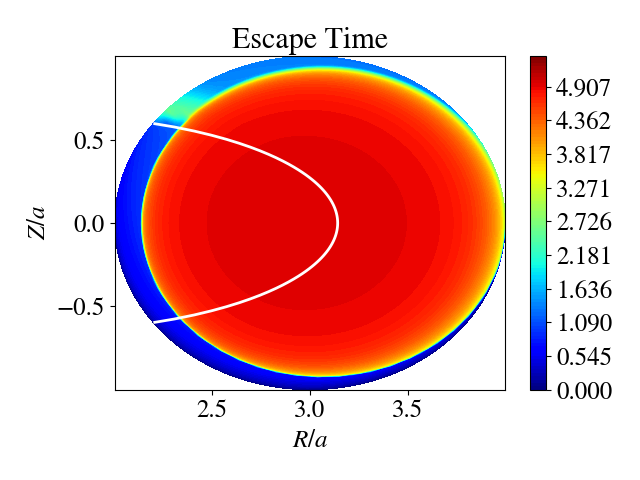
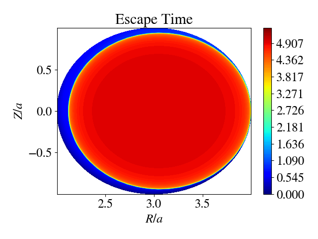
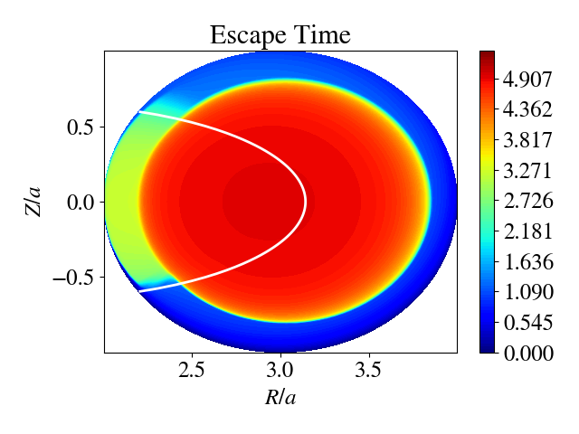
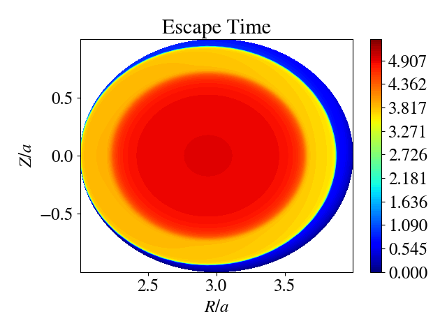
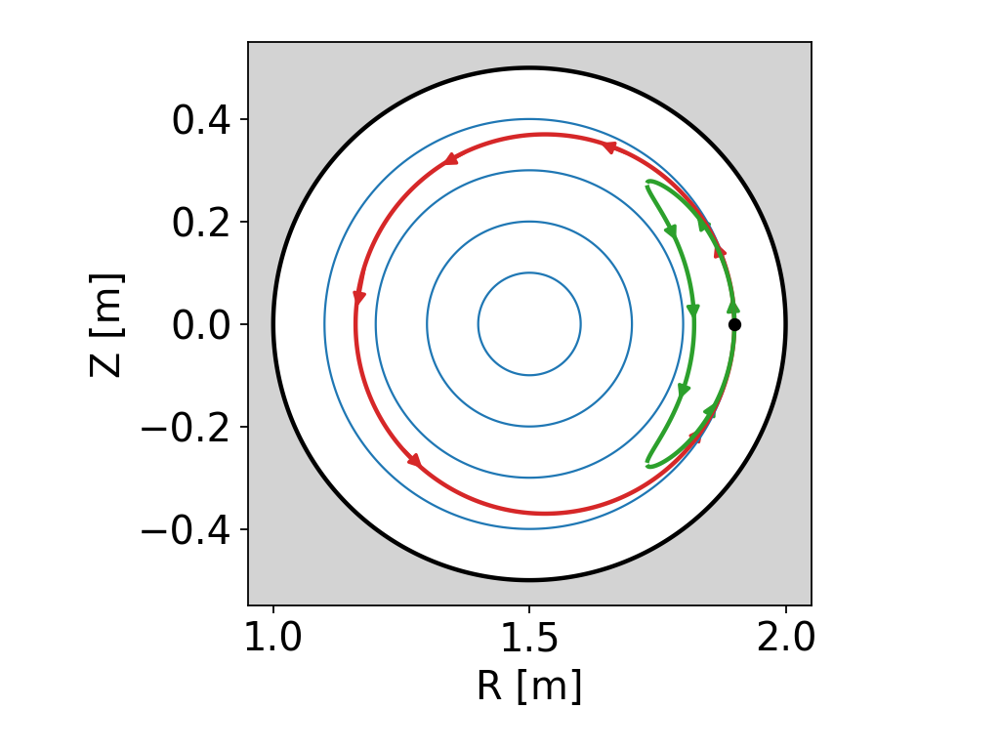
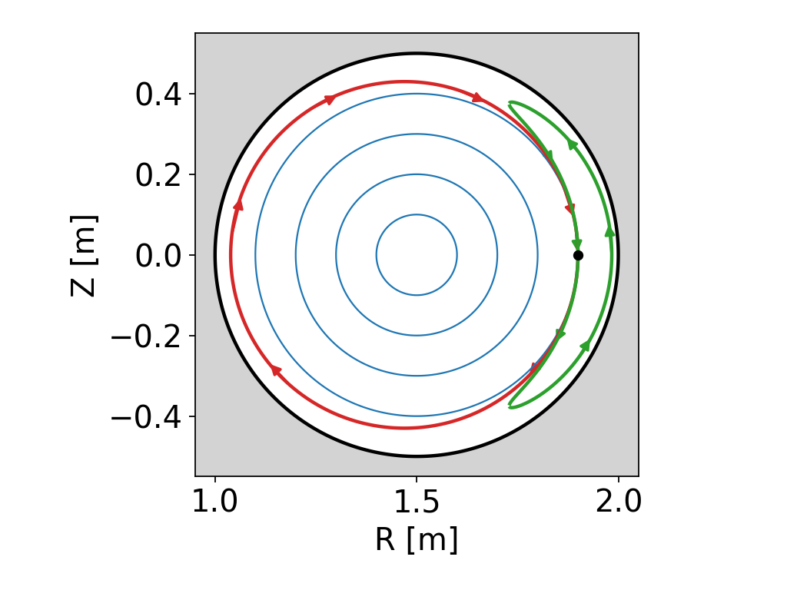

## Physics Description

This repository contains two distinct solvers designed to evaluate the **mean escape time** of energetic ions in axisymmetric tokamak geometry. The framework solves the inhomogeneous adjoint of the drift kinetic equation, providing a metric for energetic particle transport due to both direct orbit loss and collisional transport [1].

### Codes Included

#### 1. Physics-Informed Neural Network (PINN)
The code evaluates the mean escape time, $T_s$, based on the inhomogeneous adjoint of the drift kinetic equation: 

$$ \dot{X} \cdot \nabla T_s + \dot{V}_{\parallel} \frac{\partial T_s}{\partial v_{\parallel}} + C^*_s(T_s) = -1 $$

The predicted mean escape time provides a metric for quality of fast ion confinement across the entire phase space.

  
  
  
  

> **Figure 2:** Mean escape time (log scale) for ions with different initial pitches, showing phase space regions of good fast ion confinement and versus prompt loss [1].

#### 2. JONTA (Just anOther fuNcTionAl pusher) Ion Guiding Center Module
A GPU-accelerated particle-based solver built on JAX and PyTorch. It utilizes a Runge-Kutta integration scheme for the guiding center equations and a Monte Carlo operator for collisions.

  
   

> **Figure 1:** Example collisionless ion orbits. **Left:** Co-current passing and trapped orbits. **Right:** Counter-current passing and trapped orbits.

## References
[1] C. J. McDevitt and J. S. Arnaud, "An Adjoint Formulation of Energetic Particle Confinement," Submitted to the Journal of Plasma Physics (Preprint: arXiv:2511.11968), 2026.