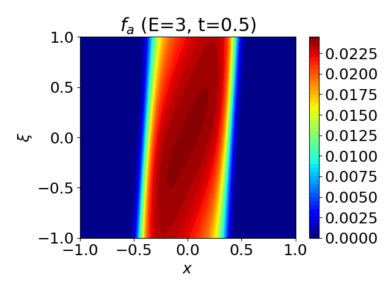
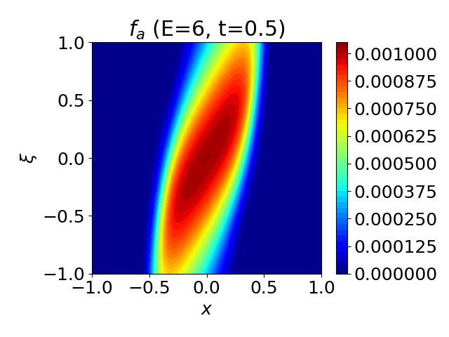
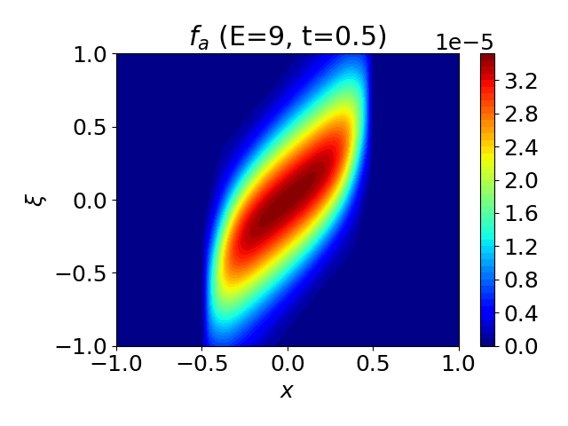
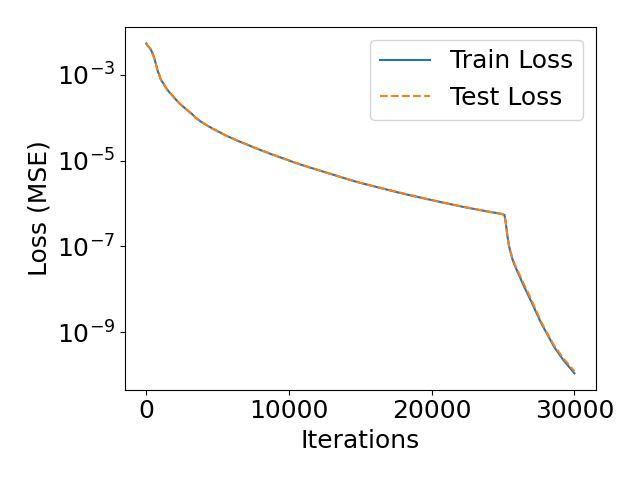

# Vlasov-Fokker-Planck solver

## Project Description
This repository contains a Physics-Informed Neural Network (PINN) implementation designed to solve the time-dependent Vlasov-Fokker-Planck (VFP) equation. As detailed in Ref. [1], this code is used to evaluate the fast ion distribution in the "hot spot" of an Inertial Confinement Fusion (ICF) target.

This code utilizes a PINN to provide a time-dependent non-perturbative solution to the fast ion tail in a 1D spatial and 2D velocity phase space ($x, E, \xi$), allowing for the accurate calculation of fusion reactivity reduction due to these kinetic effects.

The solver employs a test-particle collision operator and enforces physical symmetries and boundary conditions via specialized input/output network layers.

<p float="left">
  
  
  
  
</p>

> **Figure 1:** Energy slices of the ion distribution $f\left( x, \xi, E, t \right)$ at $t=0.5$ for energies $E/T_0 = 3$, $E/T_0 = 6$, $E/T_0 = 9$ and loss history.


## Prerequisites
*   **Python 3.12**
*   NVIDIA GPUs with CUDA 12 drivers

## Environmental Setup and Code Execution

### 1. Create Virtual Environment
Ensure you are using Python 3.12 to create the environment.

```bash
python3.12 -m venv torch_env
source torch_env/bin/activate
```

### 2. Install Dependencies
We install PyTorch and all dependencies together, pointing to the CUDA 12.4 wheel repository. This ensures all versions are compatible.

```bash
pip install --upgrade pip
pip install -r requirements.txt --extra-index-url https://download.pytorch.org/whl/cu124
```

### 3. Modify SciPy routines
Two SciPy files need to be modified inside the environment to allow SSBroyden to be used
```bash
cp _optimize.py torch_env/lib/python3.12/site-packages/scipy/optimize/.
cp _minimize.py torch_env/lib/python3.12/site-packages/scipy/optimize/.
```

### 4. Running the Code
Before running the simulation, create the required output directories inside the project folder:

```bash
mkdir figures
mkdir model
```

Run the script:

```bash
python VFPtest.py --train
```

Plot results:
```bash
python VFPtest.py --plot
```

## Reference
[1] C. J. McDevitt and X.-Z. Tang, "A physics-informed deep learning description of Knudsen layer reduction," Phys. Plasmas **31**, 062701 (2024)

